# Start Your VibeFlow！

[中文文档](README_zh.md)

The invention of the spinning jenny transformed textile production by reducing its reliance on repetitive manual labor.

The emergence of computers further improved the efficiency of information processing, while also rapidly increasing the amount of information that people must handle.

In numerical simulation, computers already perform a large share of the computational work. However, modeling, meshing, solver configuration, post-processing, and report preparation still require extensive manual effort. Reliance on GUI-only interaction creates a high barrier to entry and leaves many repetitive tasks unresolved.

Agents introduce a new mode of interaction. They connect natural language with computer tools, translate human intent into concrete operations, make complex problems easier to approach, and reduce tedious, repetitive manual work.

VibeFlow provides an intelligent environment for numerical simulation tasks, covering the full workflow of modeling, meshing, computation, post-processing, reporting, and paper preparation in both scientific research and engineering applications.

Numerical simulation is a rigorous engineering activity. Deviations in geometric dimensions, material parameters, boundary conditions, mesh quality, solver settings, or post-processing metrics can cause the final results to diverge from the real physical problem. The core idea of VibeFlow is to let users express their intent in natural language while Agents carry out time-consuming operations. At the same time, VibeFlow preserves the parameters, files, logs, images, and conclusions generated at every step, while leaving users with full authority to review and modify them.

VibeFlow therefore keeps engineering judgment in human hands. Users are responsible for defining the problem, confirming the results, and deciding whether those results are credible. VibeFlow is responsible for organizing files, invoking tools, diagnosing errors, recording evidence, and generating reports. Together, they form an effective human–Agent collaboration model.

## VibeFlow Architecture
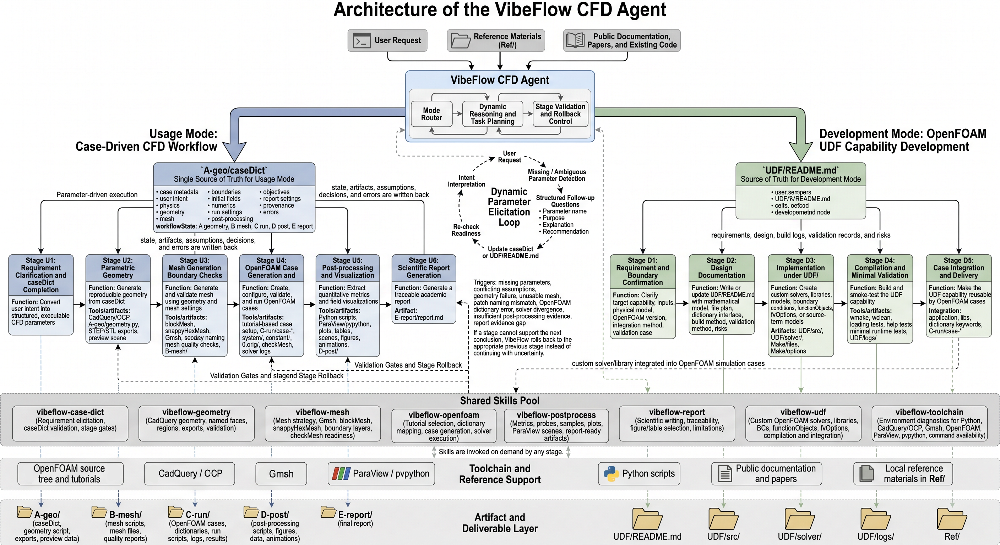

At a high level, the VibeFlow architecture can be summarized by three elements: one source of truth, two operating modes, and one evidence chain.

### caseDict
In VibeFlow, `caseDict` is the core of the entire simulation case. It records the authoritative facts of the project. The user’s objectives, physical problem, geometric parameters, materials, regions, boundaries, initial conditions, mesh requirements, numerical methods, execution settings, post-processing objectives, and reporting requirements are all written to this file.

This allows every subsequent stage to work from the same set of project facts. Geometry scripts read dimensions and entity names from `caseDict`; the meshing stage reads regions and boundaries from `caseDict`; the simulation stage reads physical models and numerical settings from `caseDict`; the post-processing stage reads the quantities that must be extracted; and the reporting stage organizes conclusions from the evidence produced by all preceding stages.

`caseDict` gives the Agent a single, detailed, inspectable, and editable file that provides the LLM with accurate project context at any time. This helps prevent information loss during context compression, long-horizon tasks, and handoffs between stages or tasks.

### Usage Mode and Development Mode
VibeFlow provides two operating modes: Usage Mode and Development Mode.

Usage Mode is designed for complete simulation tasks. It begins with requirement clarification and then proceeds through parametric geometry modeling, mesh generation, numerical simulation, post-processing and visualization, and report generation. Each stage has clearly defined inputs, outputs, and validation criteria. The workflow does not move forward blindly when critical parameters are missing, and human judgment remains necessary at every stage.

Development Mode is designed for extending solver-side capabilities. Many real research projects require custom turbulence models, material models, boundary conditions, post-processing tools, or input generators beyond those available in existing software. VibeFlow manages these development tasks in the `UDF/` directory. It first produces a design document, then implements the code, compiles and validates it, and finally integrates it into simulation cases.

The two modes are interconnected. A model completed in Development Mode can be introduced into Usage Mode to support a real simulation case. Conversely, a problem discovered in Usage Mode can drive further improvements to tools and capabilities in Development Mode.

### From User Intent to the Final Report
VibeFlow emphasizes a complete evidence chain. Every user confirmation, every modification made by the Agent, every tool execution, every error recorded in a log, and every figure generated during post-processing should have a corresponding location in the project.

This architecture makes complex work inspectable. When a result appears abnormal, the user can return to the geometry, meshing, simulation, or post-processing stage to identify the source of the problem. When a report needs to be revised, the user can trace a statement back to the relevant data and scripts instead of searching through old chat records and terminal output.

## Main Features

### 1. Unified Project Workspace

VibeFlow provides a complete project workspace. The project tree on the left organizes geometry, mesh, simulation, post-processing, reports, references, and UDF code into clearly defined locations. The center area is used for visualization and editing, while the Agent and terminal are located on the right. Users no longer need to search across multiple software windows and directories, and the current state of the project can be understood at a glance.

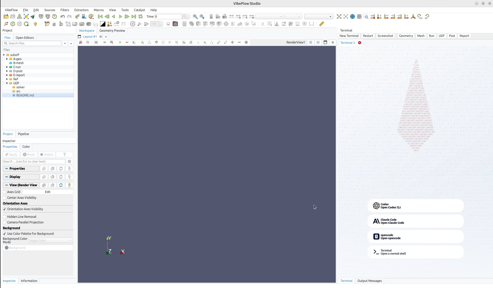

### 2. Agent-Assisted Literature Review
Simulation studies often begin with papers, manuals, experimental data, and existing cases. These materials can be placed directly in a VibeFlow project, where the Agent can read them and extract key information such as geometric constraints, material properties, boundary conditions, validation metrics, and reference results. The extracted information can then feed directly into the subsequent modeling and validation workflow.

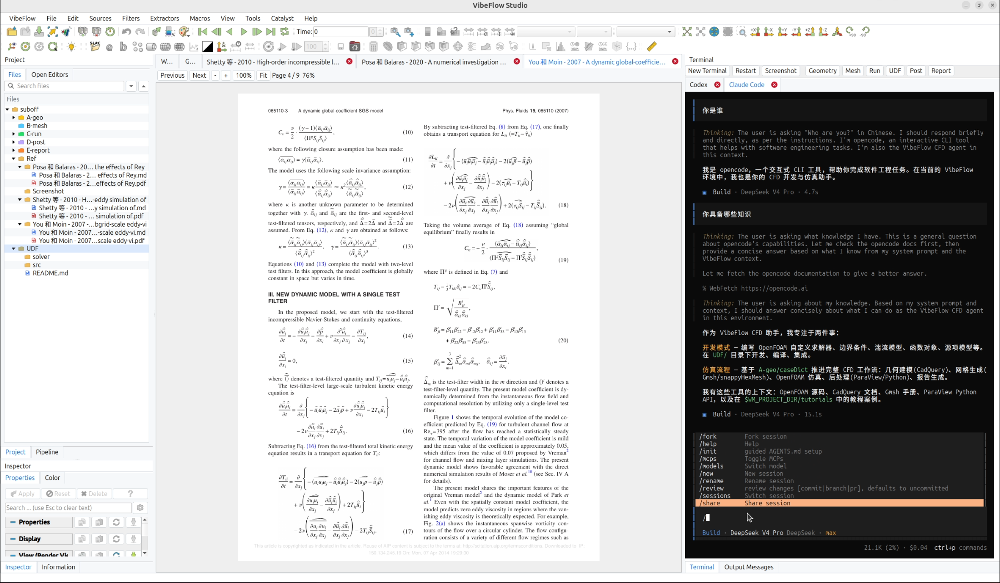

### 3. End-to-End Automated Testing and Error Repair
VibeFlow can execute complete CAE workflows through an Agent CLI. It can generate files, run commands, inspect logs, identify errors, modify settings, and perform validation again. Geometry failures, meshing failures, solver input errors, and post-processing script errors can all be handled within the same iterative process.

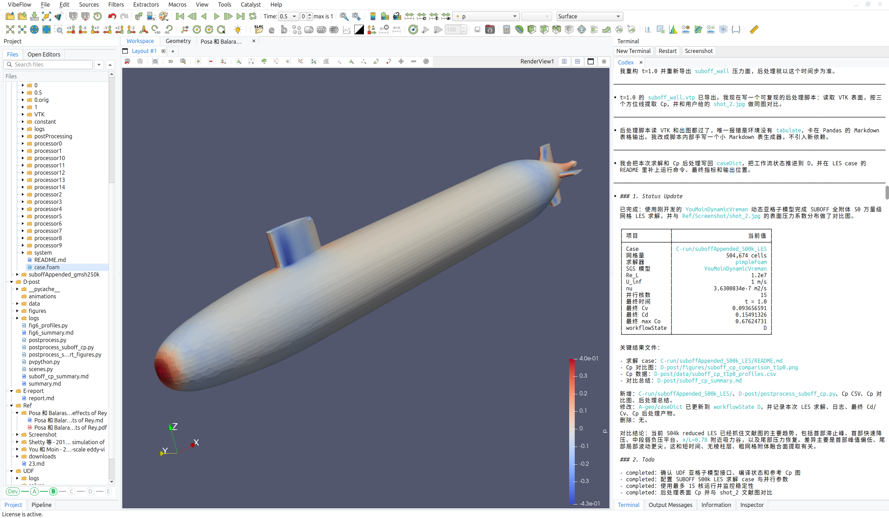

### 4. Solver Log and Residual Monitoring
VibeFlow converts residuals, time-step information, warnings, convergence status, and solver diagnostics into readable evidence. Users can detect instability, missing files, boundary mismatches, or unreasonable parameter settings earlier in the workflow. Residual histories and simulation progress can also be monitored in real time, including an estimate of the remaining computation time.

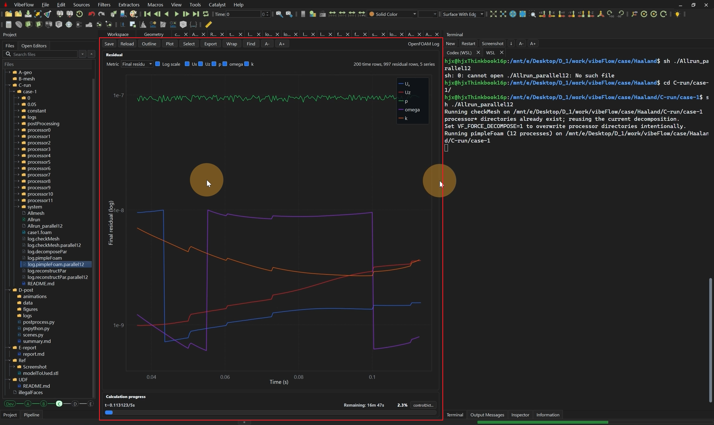

### 5. Result Comparison and Physical Validation
Simulation results must be validated. VibeFlow can generate comparison plots against reference data, experimental measurements, analytical solutions, or engineering acceptance criteria, helping users determine whether the results are credible. This makes validation faster, clearer, and more reproducible.

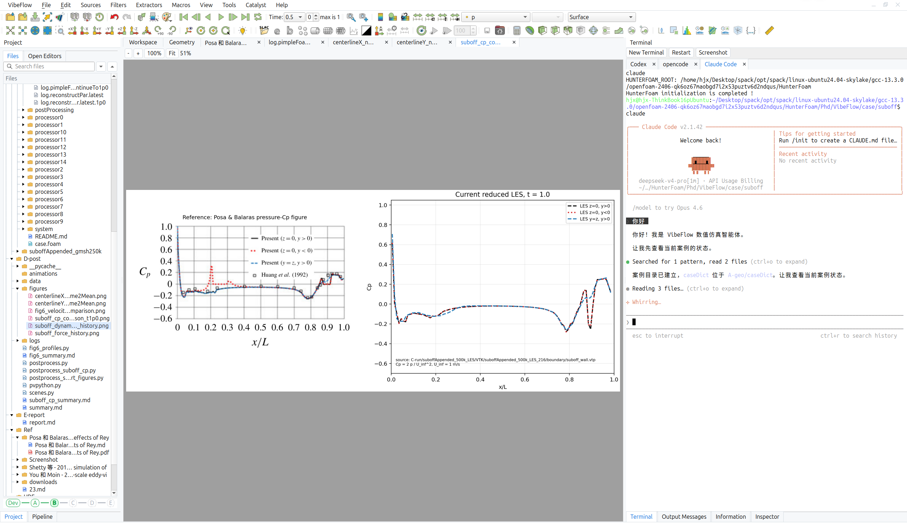

### 6. Natural-Language-Driven Geometry and Meshing
Users can describe geometry and design intent in natural language, and VibeFlow can then use tools such as CadQuery and OCP to generate parametric models. Regions, interfaces, and boundary sets retain their semantic names so that they can be used consistently in subsequent meshing and solver configuration. The models can be rebuilt, modified, and exported for continued use in downstream engineering workflows.

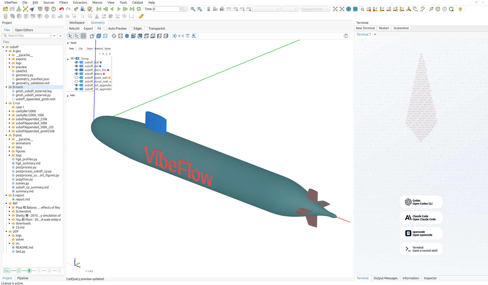

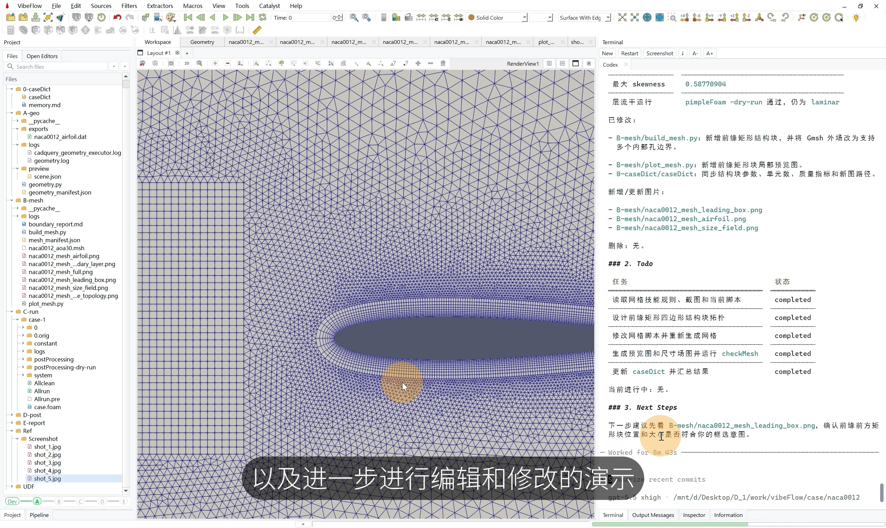

### 7. Natural-Language Post-Processing
Post-processing often requires users to remember many interface operations and scripting APIs. VibeFlow turns this process into a natural-language workflow. Users only need to specify whether they want to examine stress, displacement, pressure, temperature, velocity, slices, isosurfaces, streamlines, or probe curves. The Agent can then generate reproducible Python or ParaView scripts and automatically load the results into the platform, enabling automated post-processing entirely through natural-language instructions.

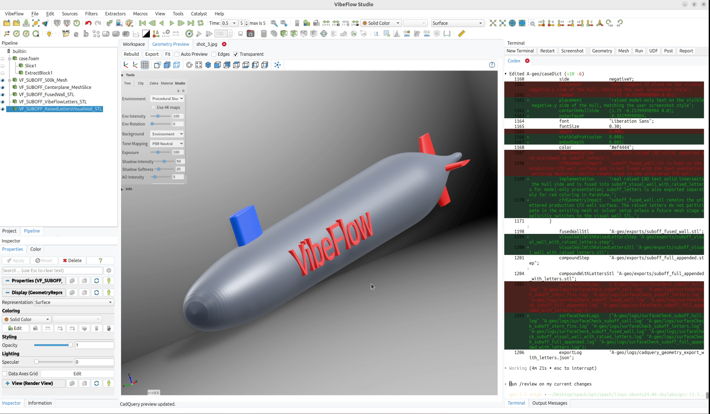

### 8. Research Reports and Papers
The report consolidates evidence from all preceding stages. VibeFlow can organize key parameters, geometry and meshing methods, solver settings, result figures and tables, validation procedures, and study limitations into a structured report. Each conclusion in the report should be traceable to the corresponding files, logs, plots, and data. VibeFlow also provides LaTeX support and built-in submission templates to make academic writing and paper preparation easier.

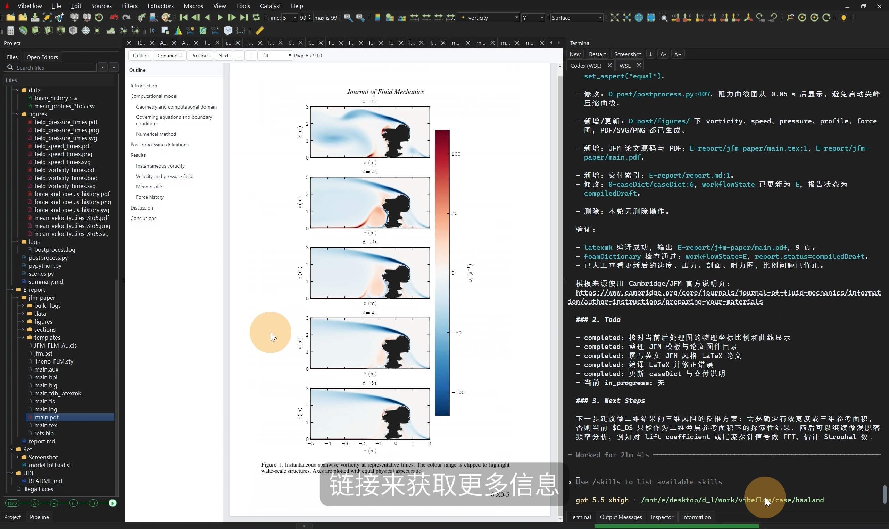

### 9. Screenshot Annotation Assistance
In many cases, users want to express instructions such as “change this area,” “this boundary is incorrect,” or “refine the mesh in this region.” Text alone may not be sufficiently direct. VibeFlow supports screenshot annotation, allowing users to circle regions, draw arrows, and add notes directly to the current view. The Agent then translates this visual information into executable modification instructions.

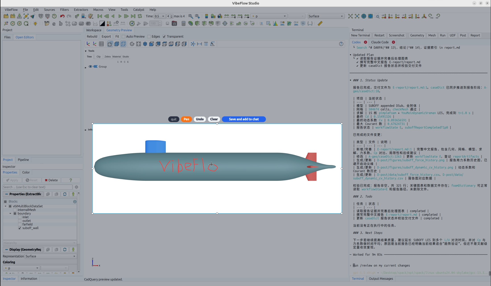

### 10. Dark Theme for Long Research Sessions
Numerical simulation often involves long periods of modeling, parameter tuning, computation, debugging, and report writing. VibeFlow provides a dark interface theme designed for extended use, helping users focus on models, data, and evidence while reducing distractions caused by the interface.

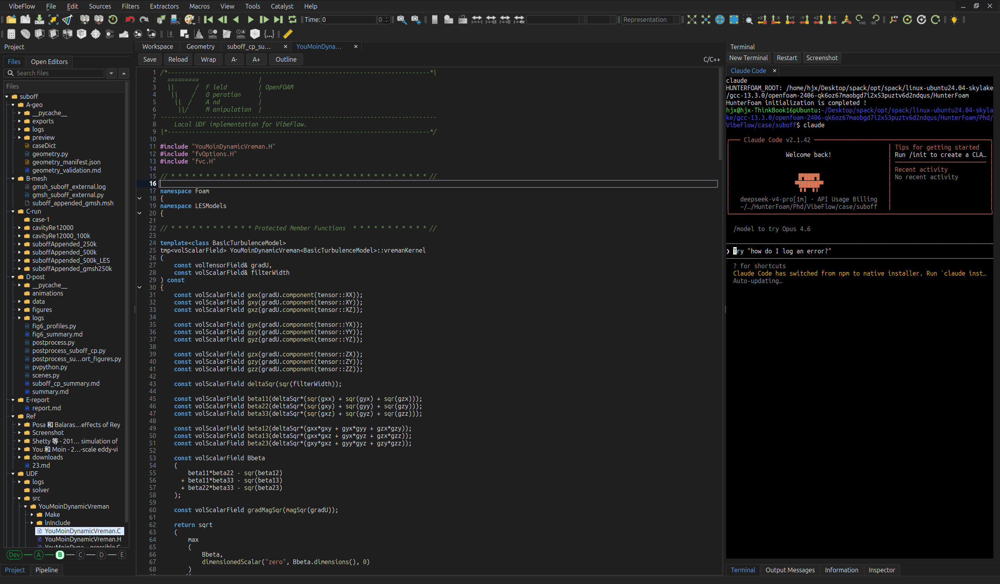

### 11. Add to Chat
A common limitation of conventional conversational AI is inaccurate or incomplete context. Users often need to manually copy code, logs, or configuration fragments, which can easily omit critical information. VibeFlow allows selected code, dictionaries, logs, and configuration blocks to be added to the conversation with one click, providing the Agent with precise local context.

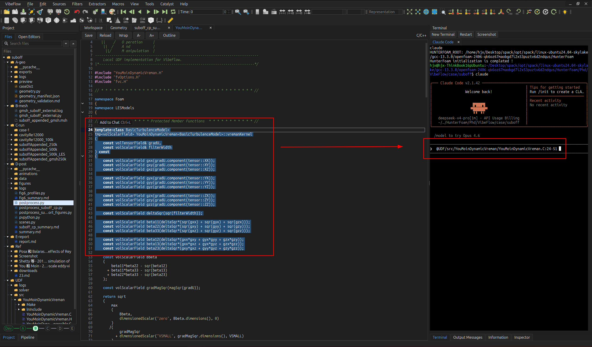

### 12. Visual OpenFOAM Parameter Panel
Editing OpenFOAM dictionary files has a relatively high learning curve and can be tedious. VibeFlow converts selected dictionary entries into visual forms and provides parameter explanations, selection guidance, and risk warnings. Users can understand what they are modifying without memorizing every keyword and can conveniently select appropriate options from drop-down menus.

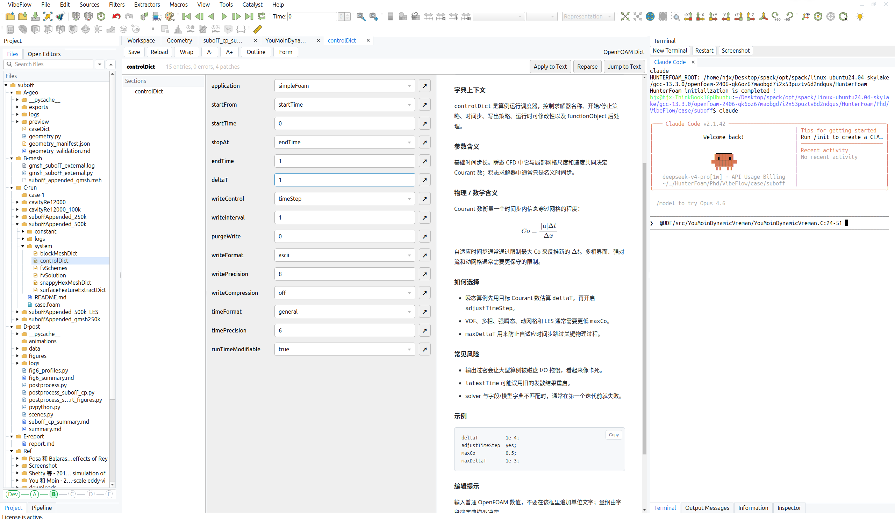

### 13. Markdown Research Notes and Report Editing
A research project produces extensive explanations, records, and stage summaries. VibeFlow includes Markdown editing and preview capabilities for tables, equations, images, code blocks, and report structures. This keeps simulation notes together with project files and allows later report preparation to continue directly from earlier work.

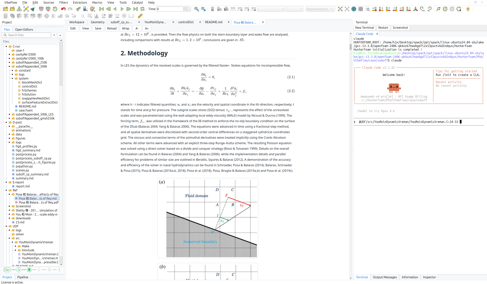

### 14. Multi-File Tab Management
A real simulation case may require many files to be open at the same time, including geometry scripts, meshing scripts, control dictionaries, solver logs, post-processing scripts, and report drafts. VibeFlow manages these files through vertical tabs. It supports more than text and code editing: CAE results can also be loaded automatically by double-clicking them.

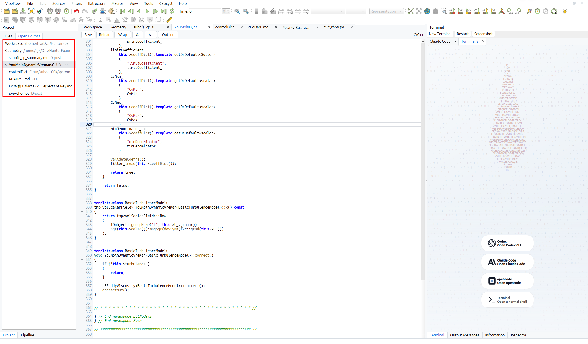

### 15. Model Backend Switching
Different tasks may be better suited to different Agent tools or model backends. VibeFlow Agent supports a wide range of international, Chinese, and locally deployed models, allowing users to choose the model that best fits their work.

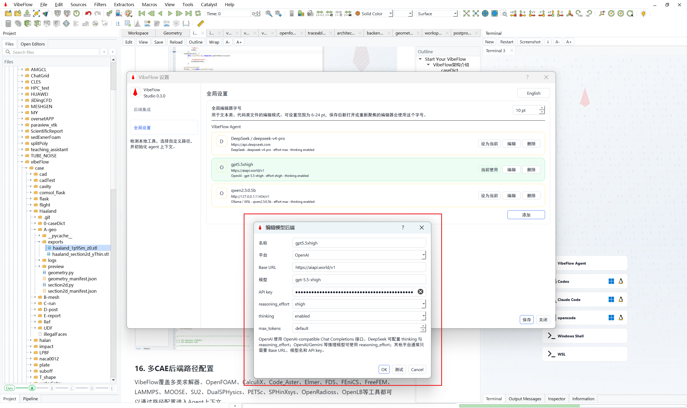

### 16. Path Configuration for Multiple CAE Backends
VibeFlow supports multiple classes of solvers and engineering tools. OpenFOAM, CalculiX, Code_Aster, Elmer, FDS, FEniCS, FreeFEM, LAMMPS, MOOSE, SU2, DualSPHysics, PETSc, SPHinXsys, OpenRadioss, OpenLB, Simcenter STAR-CCM+, COMSOL Multiphysics, Ansys Fluent, OpenVSP, and other tools can be introduced into the Agent context through local path configuration. Multiple tools can then be combined in a unified environment to build powerful CAE workflows.

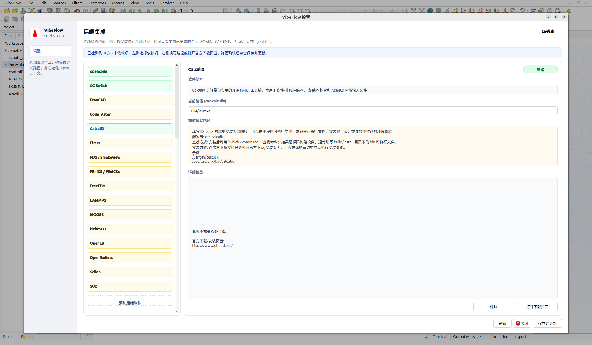

### 17. CAE Skills and Knowledge Base
Different backends have different syntax, file structures, and execution conventions. VibeFlow manages this knowledge through dedicated CAE Skills, enabling the Agent to follow the appropriate operating rules when performing tasks in OpenFOAM, structural finite-element analysis, particle methods, lattice Boltzmann methods, fire dynamics, or post-processing.

Users can actively select a Skill in VibeFlow Agent or create customized Skills for their own workflows, allowing accumulated experience to be reused in future projects.

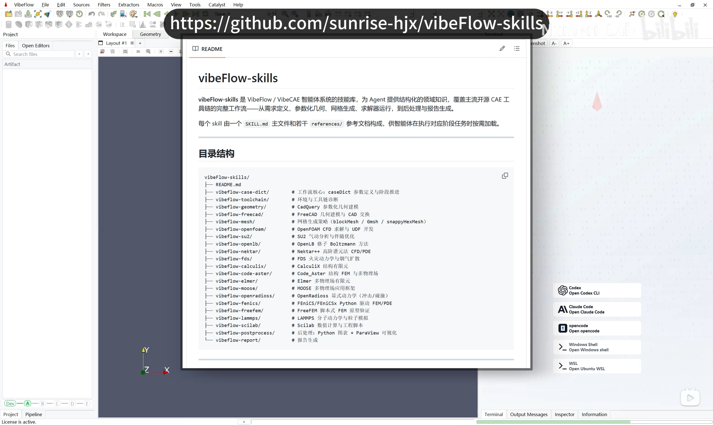

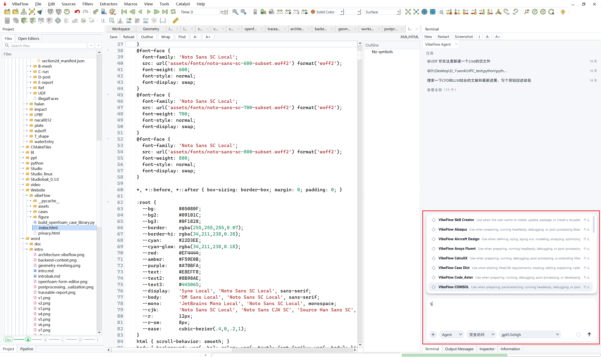

## Example
### Natural-Language-Driven Turbulence Model Development, Testing, Validation, and Engineering Simulation
[bilibili](https://player.bilibili.com/player.html?bvid=BV1c15u6eEoy&autoplay=0)

### Rapid Construction and Automated Validation of a Two-Phase Wave Model Using Natural Language
[bilibili](https://player.bilibili.com/player.html?bvid=BV18HVY65Emk&autoplay=0)

### AI-Assisted Finite-Element Analysis of a T-Shaped Beam
[bilibili](https://player.bilibili.com/player.html?bvid=BV1oyVM6HE7U&autoplay=0)

### Natural-Language-Driven Bumper-Beam Crash Simulation with OpenRadioss
[bilibili](https://player.bilibili.com/player.html?bvid=BV1yF5F6VEq4&autoplay=0)

### Agent-Assisted 3D Modeling, Modal Analysis, and Paper Writing
[bilibili](https://player.bilibili.com/player.html?bvid=BV15g7v6NEJL&autoplay=0)

### Accurate CFD Mesh Generation and Editing with an Agent
[bilibili](https://player.bilibili.com/player.html?bvid=BV1147v6pErm&autoplay=0)

### Automated CFD/CAE Post-Processing with an Agent: Describe the Task in Natural Language and Automatically Generate Results
[bilibili](https://player.bilibili.com/player.html?bvid=BV1Ts7v6REuQ&autoplay=0)

### Agent-Assisted Laser Powder Bed Fusion Simulation
[bilibili](https://player.bilibili.com/player.html?bvid=BV1Un7v64EQ7&autoplay=0)

### Automatically Calculating Erling Haaland’s Aerodynamic Drag with an Agent
[bilibili](https://player.bilibili.com/player.html?bvid=BV1CYNV6dEy2&autoplay=0)

### Agent-Assisted Multiphase Dam-Break Simulation with Simcenter STAR-CCM+
[bilibili](https://player.bilibili.com/player.html?bvid=BV1AaNV64E6n&autoplay=0)

### Agent-Assisted Natural-Convection Cooling Simulation with COMSOL Multiphysics
[bilibili](https://player.bilibili.com/player.html?bvid=BV1TsNV6wECj&autoplay=0)

### Agent-Assisted OpenVSP Aircraft Design and Preliminary Analysis
[bilibili](https://player.bilibili.com/player.html?bvid=BV1MpNV6YEFf&autoplay=0)

### Getting Started with OpenFOAM Development and Simulation Using an Agent
[bilibili](https://player.bilibili.com/player.html?bvid=BV1KtNV6FEYb&autoplay=0)

## Summary
VibeFlow is an intelligent numerical simulation workspace for scientific research and engineering applications. It uses natural language and Agents as the primary interaction layer. Through local software path configuration, command-line and Python interfaces, automated scripts, and specialized CAE Skills, VibeFlow brings requirements analysis, literature review, parametric modeling, mesh generation, numerical computation, result validation, post-processing and visualization, and report preparation into a unified workspace.

VibeFlow can connect to and orchestrate a wide range of specialized tools. These include CadQuery for parametric geometry modeling and OpenVSP for aircraft configuration design; OpenFOAM, SU2, OpenLB, FDS, Ansys Fluent, Simcenter STAR-CCM+, and COMSOL Multiphysics for fluid flow, heat transfer, combustion, and multiphysics simulation; CalculiX, Code_Aster, Elmer, FEniCS, FreeFEM, MOOSE, and OpenRadioss for structural mechanics, finite-element analysis, and partial differential equation solving; DualSPHysics, SPHinXsys, and LAMMPS for particle methods, free-surface flows, and molecular dynamics; and PETSc as a numerical computing library for parallel linear and nonlinear solvers and time integration. Together, these tools cover parametric CAD, CFD, finite-element analysis, multiphysics simulation, explicit dynamics, lattice Boltzmann methods, smoothed particle hydrodynamics, and molecular dynamics. They are incorporated into a unified Agent workflow through their respective interfaces and operating rules.

Throughout the workflow, VibeFlow uses `caseDict` to record user objectives, physical assumptions, geometric dimensions, material parameters, boundary conditions, mesh requirements, solver settings, run logs, post-processing data, and report conclusions. This keeps different software tools and workflow stages aligned around the same set of project facts. The Agent organizes files, invokes tools, checks errors, and preserves evidence, while the user retains authority over critical parameters, physical credibility, and final conclusions. As a result, complex numerical simulations become easier to begin, clearer to advance, and more traceable and reproducible.

VibeFlow aims to establish a new way of working with numerical simulation: natural language serves as the entry point while users retain full authority to review and revise the work; `caseDict` serves as the source of truth available to the Agent; professional CAE software serves as the execution layer; the Agent connects the components; and logs, plots, scripts, and reports form a traceable body of evidence.

In this workflow, users can step away from large amounts of repetitive work and reduce their dependence on memorizing software-specific keywords. They can focus instead on the questions that matter most: Is the problem clearly defined? Are the assumptions reasonable? Are the results credible? Do the conclusions support sound engineering or scientific judgment? This allows more attention to be devoted to genuinely innovative research.

## Reference
### Detailed Documentation
[VibeFlow](https://www.yuque.com/bluedreams/vibeflow)

### Join the VibeFlow Community
whatsapp: [https://chat.whatsapp.com/ELGAUIu3VLVGHcvD0zkvBT](https://chat.whatsapp.com/ELGAUIu3VLVGHcvD0zkvBT)

<table>
  <thead>
    <tr>
      <th align="center">WhatsApp</th>
      <th align="center">WeChat</th>
    </tr>
  </thead>
  <tbody>
    <tr>
      <td align="center"></td>
      <td align="center"></td>
    </tr>
  </tbody>
</table>

---

